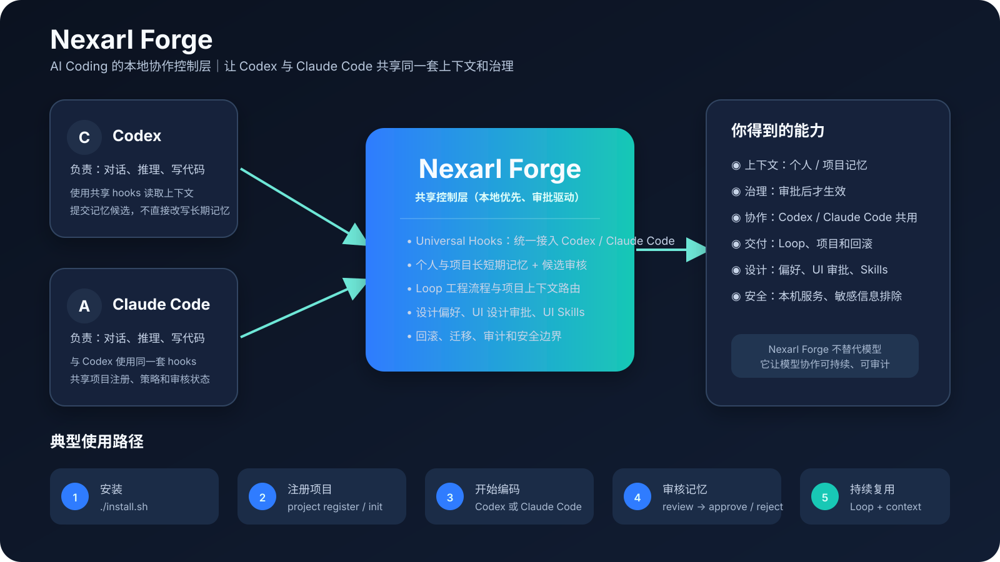
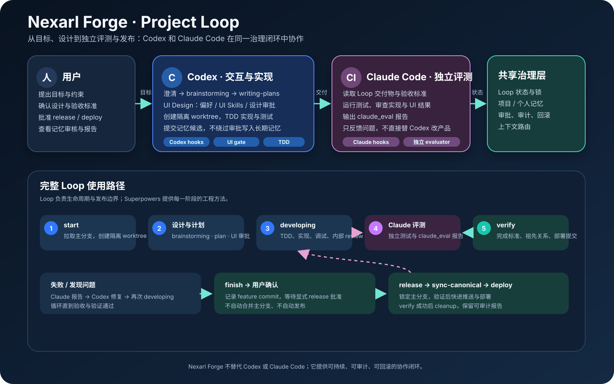

# Nexarl 协作工坊｜中文使用入口

[GitHub 仓库](https://github.com/StephenBo-China/nexarl_forge) · [中文版白皮书](WHITEPAPER.zh-CN.md) · [English whitepaper](WHITEPAPER.md) · [贡献指南](../CONTRIBUTING.md)

Nexarl 协作工坊是 Codex 与 Claude Code 共用的 macOS 本地管理器。它通过
用户级 hooks 自动提供个人与项目上下文，并把候选记忆、设计治理、UI Skills、
Loop 工作流和迁移/恢复操作集中到一个仅监听本机的后台中。





## 社区阵地

- GitHub：[Discussions](https://github.com/StephenBo-China/nexarl_forge/discussions) 用于提问、想法和实践分享；[Issues](https://github.com/StephenBo-China/nexarl_forge/issues) 用于 Bug。
- Gitee：[Issues](https://gitee.com/StephenBo_China/nexarl_forge/issues) 用于中文支持与问题反馈。
- 飞书：[加入 Nexarl Forge Open Source Community](https://applink.feishu.cn/client/chat/chatter/add_by_link?link_token=00cu754b-2a38-486b-a8a5-0ef38eabd4e8)，或扫描[群二维码](community/feishu-qr.png)。

请勿在社区发布 API Key、Token、密码、私有源码、个人记忆文件或未脱敏日志。安全漏洞请按 [SECURITY.md](../SECURITY.md) 的方式私下报告。

## 快速开始

```bash
git clone git@github.com:StephenBo-China/nexarl_forge.git
cd nexarl_forge
./install.sh --with-claude-hooks
nexarl-forge doctor
nexarl-forge open
```

安装完成后请完全退出并重新打开 Codex 或 Claude Code，使客户端重新加载 hooks。
新安装的主命令为 `nexarl-forge`；历史命令 `vibe-memory` 仍保留为兼容别名。
产品名称为 **Nexarl 协作工坊**。

## 完整使用说明

以下章节覆盖当前版本全部用户功能：

- [安装、首次配置与启动](MEMORY_REVIEW_USER_GUIDE.zh-CN.md#1-从克隆开始安装)
- [当前记忆、候选审批与隐私策略](MEMORY_REVIEW_USER_GUIDE.zh-CN.md#6-审批与隐私治理)
- [个人长期/短期记忆与项目长短期记忆](MEMORY_REVIEW_USER_GUIDE.zh-CN.md#5-hook-与模型各自负责什么)
- [项目注册、初始化、切换及未注册 cwd 边界](MEMORY_REVIEW_USER_GUIDE.zh-CN.md#3-注册与初始化项目边界)
- [审核台全部功能总览](MEMORY_REVIEW_USER_GUIDE.zh-CN.md#7-审核台全部功能)
- [设计偏好与 UI 设计审批](MEMORY_REVIEW_USER_GUIDE.zh-CN.md#8-ui-设计审批要点)
- [UI Skills 导入、审批、发布、禁用与回滚](MEMORY_REVIEW_USER_GUIDE.zh-CN.md#9-ui-skills-与恢复)
- [Loop × Superpowers 初始化、升级与发布边界](MEMORY_REVIEW_USER_GUIDE.zh-CN.md#10-loop-与发布审批边界)
- [旧项目迁移](MEMORY_REVIEW_USER_GUIDE.zh-CN.md#4-旧安装迁移先预览再批准)
- [日常检查、更新、回滚、修复与卸载](MEMORY_REVIEW_USER_GUIDE.zh-CN.md#11-日常检查与-doctor)
- [故障排查与开发者流程](MEMORY_REVIEW_USER_GUIDE.zh-CN.md#15-服务与-launchagent-故障排查)

## 记忆与项目边界

```bash
nexarl-forge project register "/path/to/workspace"
nexarl-forge project init "/path/to/workspace"
nexarl-forge project list
```

已注册 cwd 会提供项目和个人上下文；未注册 cwd 只沉淀个人候选，不创建项目记忆，
也不会自动加入项目注册表。个人长期/短期记忆和项目长期记忆必须逐条审核后才会生效。

## 审核台入口

```bash
nexarl-forge open
```

后台包含：当前记忆与待审批队列、已生效记忆、项目管理、设计偏好、UI 设计审批、
UI Skills、Loop、迁移、记忆策略、审计、备份、修复和恢复。服务只绑定
`127.0.0.1`，不要暴露到公网。

## 其他操作

```bash
nexarl-forge update --source-root "/path/to/local/clone"
nexarl-forge rollback
nexarl-forge repair
nexarl-forge hooks status
nexarl-forge hooks repair
nexarl-forge uninstall
```

默认卸载保留记忆、审批记录、项目注册表、设计数据、UI Skills 与 Loop 状态；删除
数据必须显式提供批准标志和逐个精确路径。

> 详细的逐步操作、参数说明、治理规则和故障处理，请阅读完整的
> [Nexarl 协作工坊中文使用说明](MEMORY_REVIEW_USER_GUIDE.zh-CN.md)。
